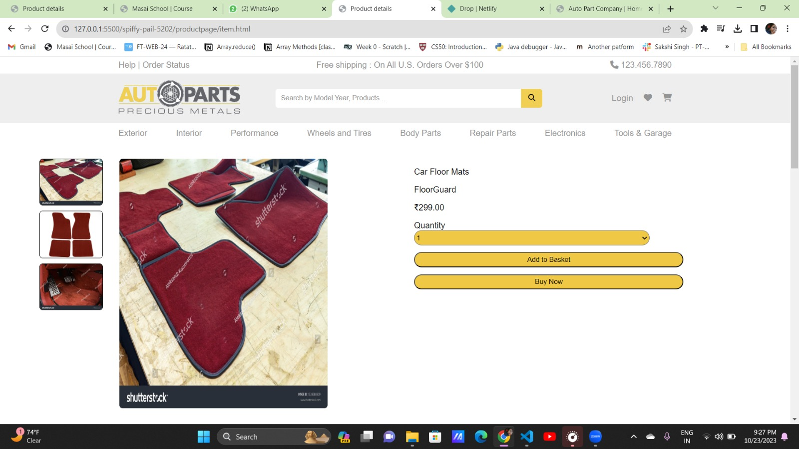

# Auto Parts

<h1>Auto Parts construct week project</h1>
<h3>Description</h3>

<b>This is a collaborative project. Build using HTML, CSS, JS along with a team of 4 members in 7 days. </b>

</img>

 
<h3>Preview-</h3>
<ul>
<li><i>Live Link-<a href="https://650b2f84de1078243d876e0c--effervescent-tulumba-71b6b7.netlify.app/" target="_blank">Click here</a></i></li>
<li><i>Code Base-<a href="https://github.com/MridulKatara/potent-toothbrush-7925" target="_blank">Click here</a></i></li>
</ul>
 
<h3>Tech Used-</h3>
<ul>
<li><i>Javascript</i></li>
<li><i>HTML</i></li>
<li><i>CSS</i></li>
<li><i>Local Storage</i></li>
</ul>
 
<h3>Team Members-</h3>
<ol>
<li><i><a href="https://www.linkedin.com/in/mridul-katara-a1a625151" target="_blank">Mridul Katara</a></i></li>
<li><i><a href="https://www.linkedin.com/in/sakshi-singh-676631148/" target="_blank">Sakshi Singh</a></i></li>
<li><i><a href="https://www.linkedin.com/in/rensi-dudhat-95752115b/" target="_blank">Rishita Mukherjee</a></i></li>
<li><i><a href="https://www.linkedin.com/in/surendrasingh109/original_referer=" target="_blank">Surendra Singh</a></i></li>
<li><i><a href="https://www.linkedin.com/in/madhushdhan-152452n/original_referer=" target="_blank">Madhu Sudhan</a></i></li>
</ol>
<h3>Work description-</h3>
<ul list-style-type="square">

  <li><h1>Home Page</h1> 
  

   
   
<li><h1>Home Page</h1></li> 
  

  
   
   
<li><h1>Signup Page</h1></li> 
  

    
  
<li><h1>Login Pages</h1></li> 
  

    
<li><h1>Home Page</h1></li> 
  

    
<li><h1>Home Page </h1></li> 
    
  

    
<li><h1>Product Details Page </h1></li> 
    
  

    
<li><h1>Product Page</h1></li> 
  

   
  
  

    
</ul>
 
 